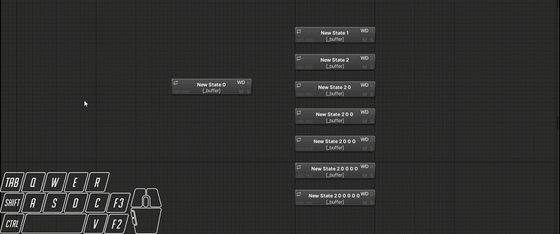
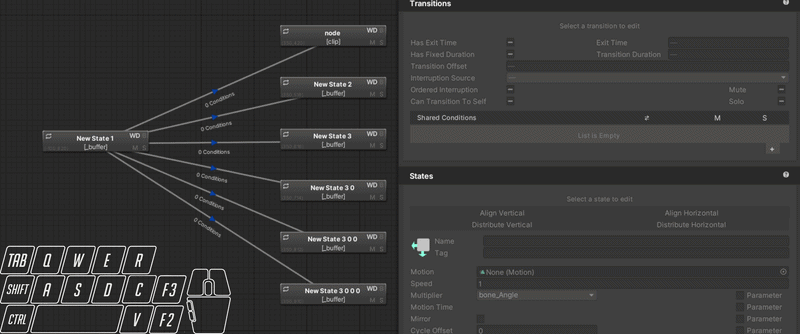
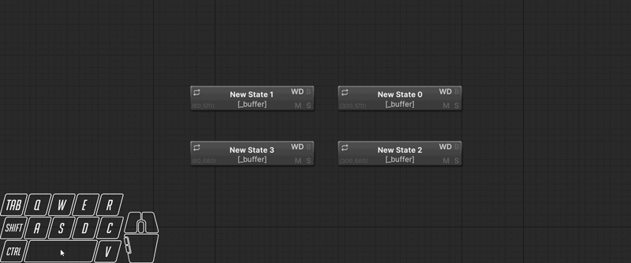
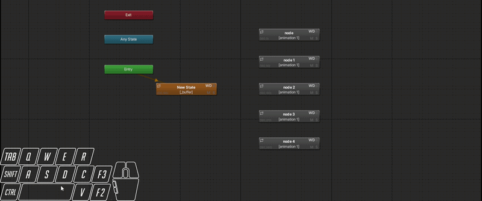
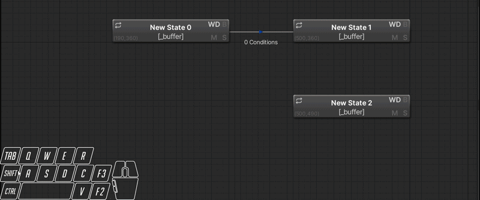
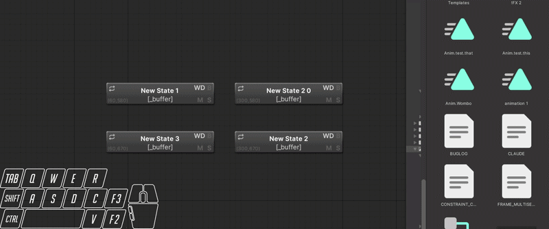
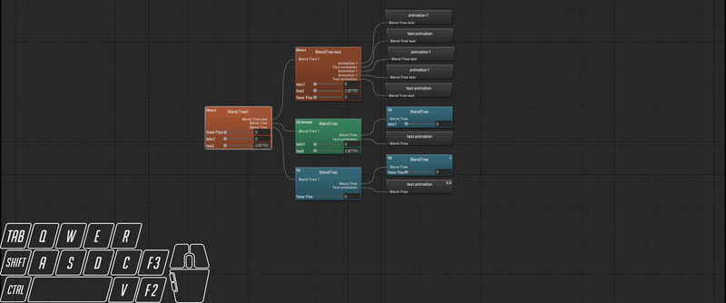
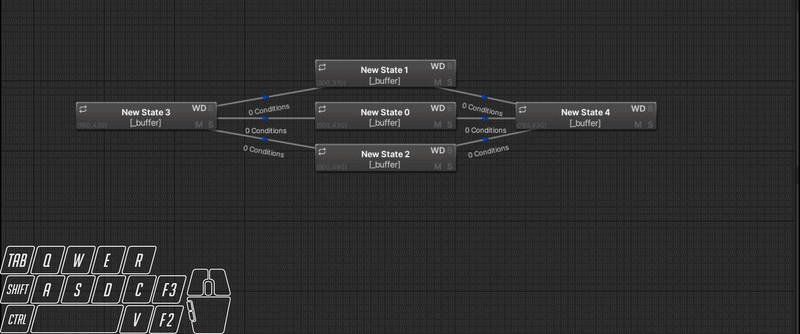
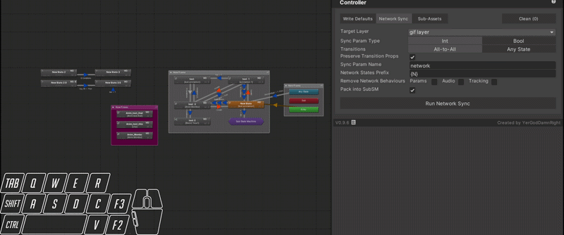

<h1 style="text-align: center;">YGDR Animator Editor</h1>

<strong>Multi-transition editing · Inline rename · Blend tree enchancements · VRC integration · Parameter management</strong>

  
  
  
  
  

  <a href="#installation">Install</a> ·
  <a href="#features">Features</a> ·
  <a href="#usage">Usage</a> ·
  <a href="./Packages/com.ygdr.animator/YGDR%20Animator%20Editor%20Docs.md">Docs</a> ·
  <a href="https://github.com/YerGodDamnRight/YGDR-Animator-Editor/releases/latest">Releases</a> ·
  <a href="HOW_IT_WORKS.md">Architecture</a> ·
  <a href="LICENSE.md">License</a>

---

A Harmony-based Unity Editor extension that significantly expands the built-in Animator window. Designed for VRChat avatar creators managing complex animator controllers.

---

## Multi-Transition Editing

Select multiple transitions at once — mass-edit timing, conditions, and interruption settings simultaneously.

---

## Multi-State Editing

Batch-edit Write Defaults, motion fields, tags, and state behaviours across multiple selected states at once.

---

## Features

<strong>Graph Enhancements</strong>

- Double-click empty graph to create states
- Ctrl+A select all nodes, Ctrl+Shift+A select all transitions
- Context menus on AnyState/Exit nodes
- Frame and annotation overlays

<strong>Chain & Fan Transition Modes</strong>

Quickly wire sequential chains or radial fans of transitions without manually connecting each node.

<strong>Copy & Paste / Replicate Transitions</strong>

Copy transitions between states, replicate and redirect in bulk.

<strong>Inline Rename (F2 / F3)</strong>

Rename states, sub-state machines, and animation clips directly in the graph.

<strong>Blend Tree Enhancements</strong>

Drag-to-reparent nodes, clip drag-drop onto nodes, inline rename.

<strong>Layer & Controller Tools</strong>

Layer templates, copy/paste, reorder support, pack/unpack utilities.

<strong>VRC Integration</strong>

Parameter Driver editor, VRC sync cache, network sync pattern support, full StateMachineBehaviour editor.

<strong>Parameter Tools</strong>

- Reorder, type conversion, unused parameter indicators
- Add as AAP, find usages across layers
- Find Usage Window: search which states, transitions, and layers reference a given parameter or clip

---

## Installation

1. Get/Rate the package from [Gumroad](https://yergoddamnright.gumroad.com/l/anim-editor), [Jinxxy](https://jinxxy.com/YerGodDamnRight/anim-editor), or [Booth](https://yergoddamnright.booth.pm/)
2. Import via the [VPM repo](https://yergoddamnright.github.io/YGDR-VPM-Listing/) **or** download the latest `.unitypackage` from the [releases page](https://github.com/YerGodDamnRight/YGDR-Animator-Editor/releases/latest) and import into your project

**Requirements:**
- Unity 2022.3 LTS
- VRChat SDK 3.x *(optional — required for VRC features)*
- MDViewer 1.1.0 *(optional — enables built-in help docs)*

---

## Usage

Open via **YGDR → YGDR Animator Editor** in the Unity menu bar, or through the Animator window context menu.

Select states or transitions in the Animator graph — the editor window updates automatically.

---

## Documentation

[Full Feature Docs](./Packages/com.ygdr.animator/YGDR%20Animator%20Editor%20Docs.md) · [How It Works — Patches & Architecture](HOW_IT_WORKS.md)

---

## License

[GNU General Public License v3.0](LICENSE.md)

---

## 3rd Party Credits

[3rd Party Notices](./Packages/com.ygdr.animator/THIRD_PARTY_NOTICES.md)

---

by <a href="https://github.com/YerGodDamnRight">YerGodDamnRight</a> · Developed with AI assistance (<a href="https://claude.ai">Claude</a> / Anthropic)

